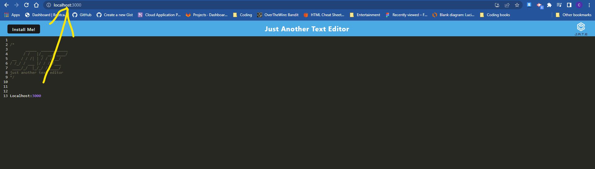
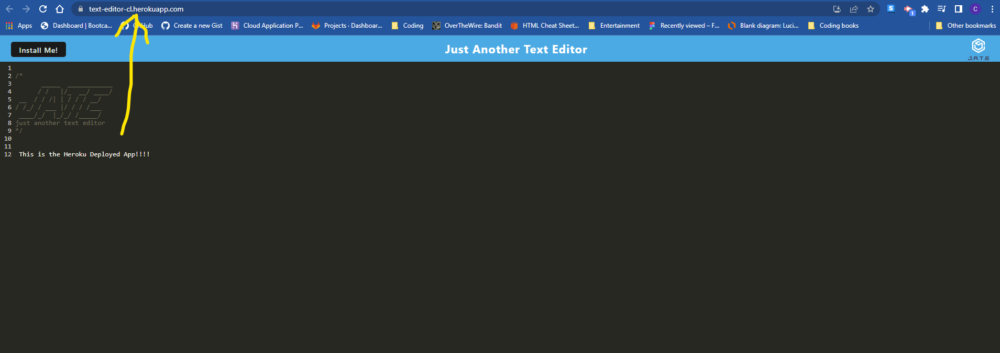
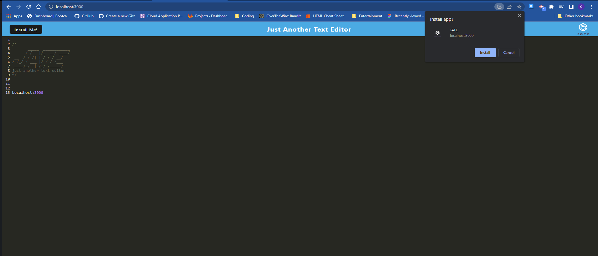
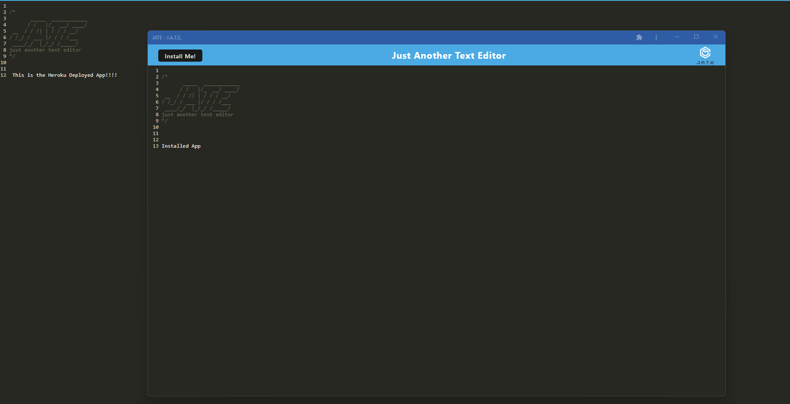

# Social-Networking


<div id="top"></div>


<details>
  <summary>Table of Contents</summary>
  <ol>
    <li>
      <a href="#about-the-project">About The Project</a>
      <ul>
        <li><a href="#link-to-deployed-project">Link to deployed project</a></li>
        <li><a href="#built-with">Built With</a></li>
        </ul>
    </li>
    <li>
      <a href="#getting-started">Getting Started</a>
      <ul>
        <li><a href="#prerequisites">Prerequisites</a></li>
        <li><a href="#installation">Installation</a></li>
      </ul>
    </li>
    <li><a href="#usage">Usage</a></li>
    <li><a href="#contact">Contact</a></li>

  </ol>
</details>


## About The Project

A standard text editor application with a generated manifest.json using the WebpackPwaManifest plug-in. Has the ability to be installed as a progressive web application. Words will appear in different colors to help differentiate code. The user is able to use this application offline or install it onto their machine. Installation will also generate a desktop icon.

<p align="right">(<a href="#top">back to top</a>)</p>


### Link to Deployed Project

[HEROKU APP](https://text-editor-cl.herokuapp.com/)

<p align="right">(<a href="#top">back to top</a>)</p>


### Built With


* [Heroku](https://dashboard.heroku.com/apps)
* [Mongoose](https://mongoosejs.com/docs/)
* [Manifest]()
* [Service Worker]()


<p align="right">(<a href="#top">back to top</a>)</p>

## Getting Started

To get a local copy up and running follow these simple example steps.

### Prerequisites

* npm
  ```sh
  npm install npm@latest -g
  ```

### Installation

1. Clone this repo 
```sh
git clone git@github.com:Montyking20/text-editor.git
```
2. Install NPM packages
   ```sh
   npm i
   ```
3. That's all there is to it!


<p align="right">(<a href="#top">back to top</a>)</p>


## Usage

Once installed run `npm start` and the API will be ready. 

### What it looks like


Local Deploy:


Heroku Deploy:


Installation prompt that appears after clicking install:


Installed and open on desktop:


<p align="right">(<a href="#top">back to top</a>)</p>


## Contact

[Project Link ](https://github.com/Montyking20/text-editor)

<p align="right">(<a href="#top">back to top</a>)</p>

